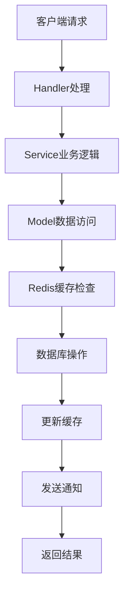
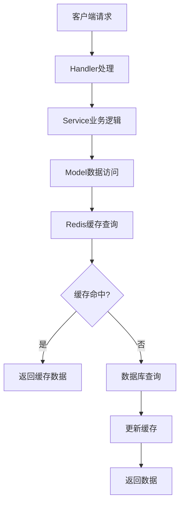
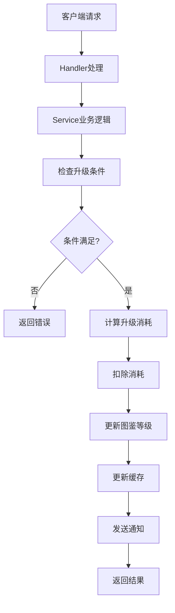

# 图鉴系统设计文档

## 概述

图鉴系统是一个用于管理NPC（非玩家角色）收集、升级和合成的游戏功能模块。系统支持多种获取方式、分片存储、缓存优化和实时通知。

## 系统架构

### 分层架构

```
┌─────────────────────────────────────┐
│            Handler Layer            │  ← 请求处理层
├─────────────────────────────────────┤
│            Service Layer            │  ← 业务逻辑层
├─────────────────────────────────────┤
│             Model Layer            │  ← 数据访问层
├─────────────────────────────────────┤
│           Storage Layer            │  ← 存储层 (Redis + MySQL)
└─────────────────────────────────────┘
```

### 核心组件

1. **数据模型** (`model/npclibrarymodel/`)
   - `NPCLibraryInfo`: 基础图鉴信息
   - `NPCLibraryInfoEx`: 扩展图鉴信息
   - `NPCLibraryModel`: 数据访问接口

2. **服务层** (`services/npclibraryservice/`)
   - `NPCLibraryService`: 业务逻辑接口
   - `NPCLibraryRedis`: Redis缓存接口

3. **处理器** (`servers/maze_main_server/process/npclibrary/`)
   - `NPCLibraryHandler`: RPC请求处理器
   - `NPCLibraryRegister`: 处理器注册

4. **协议定义** (`pb/common/NPCLibrary/`)
   - Protobuf消息定义
   - RPC接口规范

## 数据模型

### 核心数据结构

#### NPCLibraryInfo (基础信息)
```go
type NPCLibraryInfo struct {
    UserID            uint64 `json:"user_id"`             // 用户ID
    NPCRoleID         uint64 `json:"npc_role_id"`        // NPC角色ID
    NPCUserID         uint64 `json:"npc_user_id"`        // NPC用户ID
    NPCCount          int32  `json:"npc_count"`          // NPC数量
    NPCLevel          int32  `json:"npc_level"`          // NPC等级
    CreateTime        uint64 `json:"create_time"`        // 创建时间
    ChangeToken       uint64 `json:"change_token"`       // 变化令牌
}
```

#### NPCLibraryInfoEx (扩展信息)
```go
type NPCLibraryInfoEx struct {
    NPCLibraryInfo
    NextLevelNeedCount uint64 `json:"next_level_need_count"` // 下一级需要数量
    NextLevelCost      int32  `json:"next_level_cost"`       // 下一级消耗
    NextLevelCostType  int32  `json:"next_level_cost_type"`  // 消耗类型
    ComposeFlag        int32  `json:"compose_flag"`          // 合成标记
    NextCostStrength   int32  `json:"next_cost_strength"`    // 下一级消耗强度
    NextRequiredLevel  int32  `json:"next_required_level"`   // 下一级要求等级
    HP                 int32  `json:"hp"`                    // 血量
    FightVal           int32  `json:"fight_val"`             // 战斗力
    Prestige           int32  `json:"prestige"`              // 声望
    ComposeNeedCnt     int32  `json:"compose_need_cnt"`      // 合成需要数量
    Order              int32  `json:"order"`                 // 排序
    Quality            int32  `json:"quality"`               // 品质
    GroupOrder         int32  `json:"group_order"`           // 组排序
}
```

### 获取来源类型 (LibFromType)

| 类型 | 值 | 描述 |
|------|-----|------|
| CliRefresh | 1 | 战斗抓取 |
| NpcValetDrop | 2 | 跟班打工掉落 |
| TreasureBoxDrop | 3 | 普通抽卡掉落 |
| Loot | 4 | 顺 |
| FreeTreasureBoxDrop | 5 | 免费开宝箱掉落 |
| NewUserGuideAward | 6 | 新手引导掉落 |
| VipTreasureBoxDrop | 7 | vip抽卡 |
| ClientBuyNpc | 8 | 客户端购买 |
| VipReceiveAwards | 100 | vip领取奖励 |
| NewRegisterAwards | 9 | 新注册赠送星卡 |
| MiniAppsNewRegister | 10 | h5版小程序用户到客户端登录注册迁移星卡 |
| MallBuy | 11 | 商城购买 |
| PhpActive | 12 | PHP活动 |
| LootSlot | 13 | 领取槽位奖励 |
| RobSlot | 14 | 打劫槽位奖励 |
| ExploreAward | 15 | 游戏探索奖励 |
| ExchangeNpc | 270 | 提现页兑换星卡 |
| Background | 2000 | 后台操作 |
| UpProgress | 2001 | 使用碎片 |
| UpStar | 2002 | 升星 |
| FullStarClean | 2003 | 满星后清除碎片 |
| DayTask | 3000 | 日常任务 |
| SectionTask | 3001 | 章节任务 |
| Achievement | 3002 | 成就 |
| ResourceBattle | 3003 | 资源站奖励星卡碎片 |
| DiamondShop | 3004 | 钻石商店发送 |
| WebShop | 3005 | web商店-礼包 |
| RedpacketShop | 3006 | 红包商城 |
| SendSysUserId | 3007 | 后台造账号 |
| PeiyuAi | 3008 | 培育ai账号 |
| CritAddValue | 9000 | 暴击升星时,暴击出的额外碎片 |

## 数据库设计

### 分片策略

- **分片数量**: 64个分片
- **分片规则**: `(userID >> 8) % 64`
- **表名格式**: `npc_library_%d` (0-63)

### 表结构

```sql
CREATE TABLE npc_library_%d (
    id BIGINT UNSIGNED AUTO_INCREMENT PRIMARY KEY,
    host_user_id BIGINT UNSIGNED NOT NULL,
    npc_role_id BIGINT UNSIGNED NOT NULL,
    npc_user_id BIGINT UNSIGNED NOT NULL,
    npc_count INT NOT NULL DEFAULT 0,
    npc_level INT NOT NULL DEFAULT 1,
    create_time BIGINT UNSIGNED NOT NULL,
    next_level_need_count BIGINT UNSIGNED DEFAULT 0,
    next_level_cost INT DEFAULT 0,
    next_level_cost_type INT DEFAULT 0,
    compose_flag INT DEFAULT 0,
    next_cost_strength INT DEFAULT 0,
    next_required_level INT DEFAULT 0,
    hp INT DEFAULT 0,
    fight_val INT DEFAULT 0,
    prestige INT DEFAULT 0,
    compose_need_cnt INT DEFAULT 0,
    `order` INT DEFAULT 0,
    quality INT DEFAULT 0,
    group_order INT DEFAULT 0,
    created_at TIMESTAMP DEFAULT CURRENT_TIMESTAMP,
    updated_at TIMESTAMP DEFAULT CURRENT_TIMESTAMP ON UPDATE CURRENT_TIMESTAMP,
    UNIQUE KEY uk_user_npc (host_user_id, npc_role_id),
    INDEX idx_user_id (host_user_id),
    INDEX idx_npc_role_id (npc_role_id),
    INDEX idx_create_time (create_time)
) ENGINE=InnoDB DEFAULT CHARSET=utf8mb4;
```

### 存储过程

```sql
DELIMITER $$
CREATE PROCEDURE pr_add_user_npc_lib_%d(
    IN p_host_user_id BIGINT UNSIGNED,
    IN p_npc_role_id BIGINT UNSIGNED,
    IN p_npc_user_id BIGINT UNSIGNED,
    IN p_increse_npc_lib_cnt INT,
    IN p_npc_level INT,
    IN p_from_type INT
)
BEGIN
    DECLARE v_existing_count INT DEFAULT 0;
    DECLARE v_new_count INT DEFAULT 0;
    
    -- 检查是否已存在
    SELECT npc_count INTO v_existing_count 
    FROM npc_library_%d 
    WHERE host_user_id = p_host_user_id AND npc_role_id = p_npc_role_id;
    
    IF v_existing_count > 0 THEN
        -- 更新现有记录
        UPDATE npc_library_%d 
        SET npc_count = npc_count + p_increse_npc_lib_cnt,
            updated_at = CURRENT_TIMESTAMP
        WHERE host_user_id = p_host_user_id AND npc_role_id = p_npc_role_id;
    ELSE
        -- 插入新记录
        INSERT INTO npc_library_%d (
            host_user_id, npc_role_id, npc_user_id, npc_count, npc_level, 
            create_time, next_level_need_count, next_level_cost, next_level_cost_type
        ) VALUES (
            p_host_user_id, p_npc_role_id, p_npc_user_id, p_increse_npc_lib_cnt, p_npc_level,
            UNIX_TIMESTAMP(), 0, 0, 0
        );
    END IF;
END$$
DELIMITER ;
```

## 缓存设计

### Redis键设计

- **单个图鉴**: `npc_library:{userID}:{npcRoleID}`
- **用户图鉴列表**: `npc_library_list:{userID}`
- **图鉴变化令牌**: `npc_library_token:{userID}`

### 缓存策略

1. **写入策略**: Write-Through
2. **过期时间**: 3600秒
3. **更新策略**: 实时更新
4. **失效策略**: 主动失效

## RPC接口

### 添加图鉴

**请求**: `DEF_SVR_NPC_LIBRARY_ADD_RQ`
```protobuf
message NPCLibraryAddRequest {
    uint64 user_id = 1;
    uint64 npc_role_id = 2;
    uint64 npc_user_id = 3;
    int32 count = 4;
    int32 from_type = 5;
}
```

**响应**: `DEF_SVR_NPC_LIBRARY_ADD_RS`
```protobuf
message NPCLibraryAddResponse {
    int32 result = 1;
    string message = 2;
    NPCLibraryInfoEx npc_library = 3;
}
```

### 查询图鉴

**请求**: `DEF_SVR_NPC_LIBRARY_QUERY_RQ`
```protobuf
message NPCLibraryQueryRequest {
    uint64 user_id = 1;
    string cursor = 2;
    int32 limit = 3;
}
```

**响应**: `DEF_SVR_NPC_LIBRARY_QUERY_RS`
```protobuf
message NPCLibraryQueryResponse {
    int32 result = 1;
    string message = 2;
    repeated NPCLibraryInfoEx npc_libraries = 3;
    string next_cursor = 4;
    bool has_more = 5;
}
```

### 升级图鉴

**请求**: `DEF_SVR_NPC_LIBRARY_UPGRADE_RQ`
```protobuf
message NPCLibraryUpgradeRequest {
    uint64 user_id = 1;
    uint64 npc_role_id = 2;
}
```

**响应**: `DEF_SVR_NPC_LIBRARY_UPGRADE_RS`
```protobuf
message NPCLibraryUpgradeResponse {
    int32 result = 1;
    string message = 2;
    NPCLibraryInfoEx npc_library = 3;
}
```

### 检查图鉴

**请求**: `DEF_SVR_NPC_LIBRARY_CHECK_RQ`
```protobuf
message NPCLibraryCheckRequest {
    uint64 user_id = 1;
    repeated uint64 npc_role_ids = 2;
}
```

**响应**: `DEF_SVR_NPC_LIBRARY_CHECK_RS`
```protobuf
message NPCLibraryCheckResponse {
    int32 result = 1;
    string message = 2;
    repeated NPCLibraryInfoEx npc_libraries = 3;
}
```

### 获取下一级信息

**请求**: `DEF_SVR_NPC_LIBRARY_NEXTLEVEL_INFO_RQ`
```protobuf
message NPCLibraryNextLevelInfoRequest {
    uint64 user_id = 1;
    uint64 npc_role_id = 2;
}
```

**响应**: `DEF_SVR_NPC_LIBRARY_NEXTLEVEL_INFO_RS`
```protobuf
message NPCLibraryNextLevelInfoResponse {
    int32 result = 1;
    string message = 2;
    NPCLibraryInfoEx npc_library = 3;
}
```

### 强制合成NPC

**请求**: `DEF_SVR_NPC_LIBRARYS_CHECK_RQ`
```protobuf
message NPCLibraryForceComposeRequest {
    uint64 user_id = 1;
    uint64 npc_role_id = 2;
}
```

**响应**: `DEF_SVR_NPC_LIBRARYS_CHECK_RS`
```protobuf
message NPCLibraryForceComposeResponse {
    int32 result = 1;
    string message = 2;
    NPCLibraryInfoEx npc_library = 3;
}
```

### 图鉴变化通知

**通知**: `DEF_SVR_NPC_LIBRARY_NOTIFY`
```protobuf
message NPCLibraryNotify {
    uint64 user_id = 1;
    uint64 npc_role_id = 2;
    int32 change_type = 3;
    NPCLibraryInfoEx npc_library = 4;
}
```

## 业务流程

### 添加图鉴流程



### 查询图鉴流程



### 升级图鉴流程



## 配置说明

### 系统配置

```yaml
npc_library:
  # 分片配置
  sharding:
    shard_count: 64
    shard_rule: "user_id_mod"
  
  # 缓存配置
  cache:
    expire_time: 3600
    key_prefix: "npc_library"
    enabled: true
  
  # 数据库配置
  database:
    max_connections: 100
    connection_timeout: 30
    query_timeout: 10
  
  # 业务配置
  business:
    default_level: 1
    max_level: 10
    upgrade_cost:
      base_cost: 100
      level_multiplier: 1.5
      cost_type: 1
```

### 环境变量

| 变量名 | 描述 | 默认值 |
|--------|------|--------|
| DB_HOST | 数据库主机 | localhost |
| DB_PORT | 数据库端口 | 3306 |
| DB_USER | 数据库用户 | root |
| DB_PASSWORD | 数据库密码 | 空 |
| DB_NAME | 数据库名称 | maze_game |
| REDIS_HOST | Redis主机 | localhost |
| REDIS_PORT | Redis端口 | 6379 |
| REDIS_PASSWORD | Redis密码 | 空 |

## 部署说明

### 1. 环境准备

```bash
# 安装依赖
go mod tidy

# 安装MySQL客户端
# Ubuntu/Debian
sudo apt-get install mysql-client

# CentOS/RHEL
sudo yum install mysql

# 安装Redis客户端
# Ubuntu/Debian
sudo apt-get install redis-tools

# CentOS/RHEL
sudo yum install redis
```

### 2. 数据库初始化

```bash
# 设置环境变量
export DB_HOST=localhost
export DB_PORT=3306
export DB_USER=root
export DB_PASSWORD=your_password
export DB_NAME=maze_game

# 执行初始化脚本
chmod +x scripts/npc_library_setup.sh
./scripts/npc_library_setup.sh
```

### 3. 启动服务

```bash
# 启动主服务器
go run servers/maze_main_server/main.go
```

### 4. 验证部署

```bash
# 运行测试
go test ./tester/npc_library_t/... -v
```

## 监控和运维

### 关键指标

1. **性能指标**
   - 响应时间
   - 吞吐量
   - 错误率

2. **业务指标**
   - 图鉴添加成功率
   - 升级成功率
   - 查询命中率

3. **系统指标**
   - 数据库连接数
   - Redis内存使用
   - CPU使用率

### 日志配置

```yaml
logging:
  level: "info"
  file_path: "logs/npc_library.log"
  max_size: 100
  max_age: 7
  max_backups: 3
```

### 告警配置

```yaml
monitoring:
  enabled: true
  collect_interval: 30
  alerts:
    error_rate_threshold: 0.05
    response_time_threshold: 1000
    db_connection_threshold: 80
```

## 故障排查

### 常见问题

1. **数据库连接失败**
   - 检查数据库服务状态
   - 验证连接参数
   - 检查网络连通性

2. **Redis连接失败**
   - 检查Redis服务状态
   - 验证连接参数
   - 检查内存使用情况

3. **分片表不存在**
   - 检查初始化脚本执行结果
   - 验证分片规则
   - 重新执行初始化

4. **缓存不一致**
   - 检查缓存更新逻辑
   - 验证数据同步
   - 清理缓存重新加载

### 调试工具

```bash
# 检查数据库表
mysql -h$DB_HOST -P$DB_PORT -u$DB_USER -p$DB_PASSWORD $DB_NAME -e "SHOW TABLES LIKE 'npc_library_%';"

# 检查Redis连接
redis-cli -h$REDIS_HOST -p$REDIS_PORT ping

# 查看日志
tail -f logs/npc_library.log
```

## 扩展说明

### 功能扩展

1. **新增获取来源**
   - 在`LibFromType`中添加新类型
   - 更新业务逻辑处理

2. **新增图鉴属性**
   - 扩展`NPCLibraryInfoEx`结构
   - 更新数据库表结构
   - 更新缓存逻辑

3. **新增业务规则**
   - 在Service层添加新方法
   - 更新Handler层处理
   - 添加新的RPC接口

### 性能优化

1. **缓存优化**
   - 调整缓存过期时间
   - 优化缓存键设计
   - 实现缓存预热

2. **数据库优化**
   - 添加索引优化查询
   - 调整分片策略
   - 优化SQL语句

3. **并发优化**
   - 调整连接池大小
   - 优化锁机制
   - 实现异步处理

## 版本历史

| 版本 |  描述 |
|------|------|------|
| v1.0.0 | 初始版本，基础功能实现 |
| v1.1.0 |  添加缓存优化 |
| v1.2.0 |  添加分片支持 |
| v1.3.0 | 添加监控和告警 |


