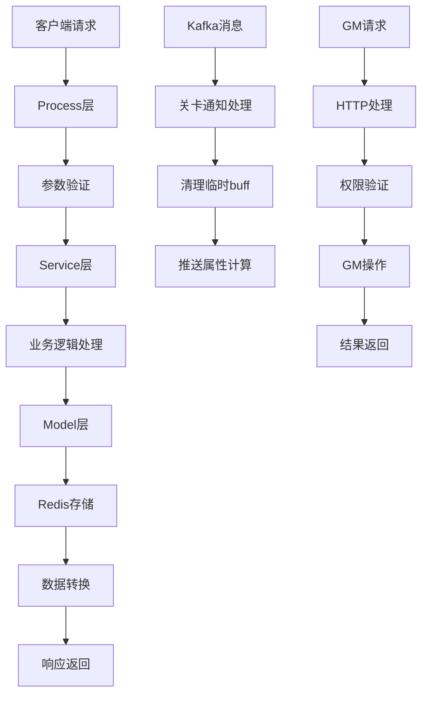

# Buff包功能文档

## 概述

Buff包是迷宫游戏中的临时增益系统，允许玩家在游戏过程中选择各种增益效果来增强角色能力。系统支持等级选择和道具选择两种方式获取buff，并提供了刷新机制来重新随机可选buff。

## 目录结构

```
servers/maze_main_server/process/buff/
├── process.go                           # 主入口文件，定义Buff结构体和初始化
├── get_buff_list_process.go            # 获取buff列表处理
├── get_optional_buff_process.go        # 获取可选buff列表处理
├── select_buff_process.go              # 选择buff处理
├── refresh_optional_buff_process.go    # 刷新可选buff处理
├── gm_process.go                       # GM管理功能
├── maze_barrier_notify.go              # 迷宫关卡通知处理
└── *_test.go                          # 测试文件
```

## 核心功能模块

### 1. 主入口模块 (process.go)

**功能**: 定义Buff结构体和系统初始化

**核心结构**:
```go
type Buff struct {
    component.Base
}
```

**主要方法**:
- `NewBuff()`: 创建Buff实例
- `RegTcpHandler()`: 注册TCP处理器（已注释）
- `InitKafkaConsumer()`: 初始化Kafka消费者

**关键逻辑**:
- 继承自`component.Base`，符合nano框架规范
- 注册迷宫关卡通知的Kafka消费者
- 支持WebSocket和TCP两种通信方式

### 2. 获取Buff列表模块 (get_buff_list_process.go)

**功能**: 处理客户端获取当前buff列表的请求

**接口**: `GetMazeTempBuffListRQ_10433_10434`

**请求参数**:
- `StageId`: 关卡ID
- `Header`: 请求头信息

**响应数据**:
- `BuffList`: 当前拥有的buff列表
- `ErrInfo`: 错误信息

**核心逻辑**:
```go
func (b *Buff) GetMazeTempBuffListRQ_10433_10434(s *session.Session, req *MazeTempBuff.GetMazeTempBuffListRQ) (err error) {
    // 1. 参数验证
    userId, stageId := uint64(s.UID()), req.GetStageId()
    if userId == 0 || stageId == 0 {
        return errors.COMMON_ERROR_TIPS.Wrap("参数错误")
    }
    
    // 2. 调用服务层获取buff列表
    buffList, err := tempbuffservice.GlobalTempBuffService.GetMazeTempBuffList(logger, userId, stageId)
    
    // 3. 数据转换并返回
    res.BuffList = buffInfo2MazeBuffInfo(buffList)
    return s.Response(res)
}
```

**数据转换**:
- 将内部`BuffInfo`结构转换为protobuf格式
- 包含buff ID、数值、名称、描述、推荐标识等信息

### 3. 获取可选Buff模块 (get_optional_buff_process.go)

**功能**: 处理客户端获取可选buff列表的请求

**接口**: `GetOptionalMazeTempBuffListRQ_10435_10436`

**请求参数**:
- `StageId`: 关卡ID
- `Level`: 等级
- `Type`: buff类型（等级选择/道具选择）
- `AreaId`: 区域ID
- `AreaIndex`: 子区域索引
- `AttrMask`: 属性掩码

**响应数据**:
- `OptionalBuffInfo`: 可选buff信息
  - `SelectBuffList`: 可选buff列表
  - `IsRefresh`: 是否可以刷新
  - `Cost`: 刷新消耗
  - `SelectBuffTime`: 选择时间配置

**核心逻辑**:
```go
func (b *Buff) GetOptionalMazeTempBuffListRQ_10435_10436(s *session.Session, req *MazeTempBuff.GetOptionalMazeTempBuffListRQ) (err error) {
    // 1. 参数验证
    userId, stageId, level, buffType, areaId := uint64(s.UID()), req.GetStageId(), req.GetLevel(), int32(req.GetType()), req.GetAreaId()
    
    // 2. 类型验证
    if buffType != int32(MazeTempBuff.Type_UP_LEVEL) && buffType != int32(MazeTempBuff.Type_USE_ITEM) {
        return errors.COMMON_ERROR_TIPS.Wrap("buff类型参数错误")
    }
    
    // 3. 区域验证
    if buffType == int32(MazeTempBuff.Type_UP_LEVEL) && areaId == 0 {
        return errors.COMMON_ERROR_TIPS.Wrap("areaId参数错误")
    }
    
    // 4. 调用服务层获取可选buff
    optionalBuffInfo, err := tempbuffservice.GlobalTempBuffService.GetOptionalTempBuffList(
        logger, userId, stageId, level, int32(req.GetType()), areaId, req.GetAreaIndex(), req.GetAttrMask())
    
    // 5. 数据转换并返回
    res.OptionalBuffInfo = OptionalBuffInfo2PbOptionalBuffInfo(optionalBuffInfo)
    return s.Response(res)
}
```

**数据转换**:
- 将内部`OptionalBuffInfo`结构转换为protobuf格式
- 包含可选buff列表、刷新状态、消耗信息等

### 4. 选择Buff模块 (select_buff_process.go)

**功能**: 处理客户端选择buff的请求

**接口**: `SelectMazeTempBuffRQ_10437_10438`

**请求参数**:
- `StageId`: 关卡ID
- `Level`: 等级
- `BuffId`: 选择的buff ID
- `Type`: buff类型

**响应数据**:
- `BuffList`: 更新后的buff列表
- `ErrInfo`: 错误信息

**核心逻辑**:
```go
func (b *Buff) SelectMazeTempBuffRQ_10437_10438(s *session.Session, req *MazeTempBuff.SelectMazeTempBuffRQ) (err error) {
    // 1. 参数验证
    userId, stageId, level, buffId, buffType := uint64(s.UID()), req.GetStageId(), req.GetLevel(), req.GetBuffId(), int32(req.GetType())
    
    // 2. 类型验证
    if buffType != int32(MazeTempBuff.Type_UP_LEVEL) && buffType != int32(MazeTempBuff.Type_USE_ITEM) {
        return errors.COMMON_ERROR_TIPS.Wrap("buff类型参数错误")
    }
    
    // 3. 调用服务层选择buff
    buffList, err := tempbuffservice.GlobalTempBuffService.SelectMazeTempBuff(
        logger, userId, stageId, level, buffId, buffType)
    
    // 4. 返回更新后的buff列表
    res.BuffList = buffInfo2MazeBuffInfo(buffList)
    return s.Response(res)
}
```

### 5. 刷新可选Buff模块 (refresh_optional_buff_process.go)

**功能**: 处理客户端刷新可选buff列表的请求

**接口**: `RefreshOptionalMazeTempBuffListRQ_10439_10440`

**请求参数**:
- `StageId`: 关卡ID
- `Level`: 等级
- `AreaId`: 区域ID
- `Type`: buff类型
- `Cost`: 刷新消耗
- `AttrMask`: 属性掩码

**响应数据**:
- `OptionalBuffInfo`: 刷新后的可选buff信息

**核心逻辑**:
```go
func (b *Buff) RefreshOptionalMazeTempBuffListRQ_10439_10440(s *session.Session, req *MazeTempBuff.RefreshOptionalMazeTempBuffListRQ) (err error) {
    // 1. 参数验证
    userId, stageId, level, cost, areaId, buffType := uint64(s.UID()), req.GetStageId(), req.GetLevel(), req.GetCost(), req.GetAreaId(), int32(req.GetType())
    
    // 2. 类型和区域验证
    if buffType != int32(MazeTempBuff.Type_UP_LEVEL) && buffType != int32(MazeTempBuff.Type_USE_ITEM) {
        return errors.COMMON_ERROR_TIPS.Wrap("buff类型参数错误")
    }
    if buffType == int32(MazeTempBuff.Type_UP_LEVEL) && areaId == 0 {
        return errors.COMMON_ERROR_TIPS.Wrap("areaId参数错误")
    }
    
    // 3. 调用服务层刷新buff
    optionalBuffInfo, err := tempbuffservice.GlobalTempBuffService.RefreshOptionalMazeTempBuffList(
        logger, userId, stageId, level, areaId, req.GetAttrMask(), cost)
    
    // 4. 返回刷新后的可选buff信息
    res.OptionalBuffInfo = OptionalBuffInfo2PbOptionalBuffInfo(optionalBuffInfo)
    return s.Response(res)
}
```

### 6. GM管理模块 (gm_process.go)

**功能**: 提供GM管理功能，支持通过HTTP接口管理buff

**主要接口**:

#### 6.1 设置Buff接口
**路径**: `/s{sectionId}/setMazeTempBuff`

**参数**:
- `userid`: 用户ID
- `stageId`: 关卡ID
- `buffs`: buff ID列表（逗号分隔）

**功能**:
- 为指定用户设置指定的buff
- 验证buff配置的有效性
- 更新用户buff状态
- 推送buff变化消息

**核心逻辑**:
```go
SafeHttpRegister(logger, "/setMazeTempBuff", func(writer http.ResponseWriter, request *http.Request) {
    // 1. 解析参数
    userId := fkutil.ToUint64(request.Form.Get("userid"))
    stageId := fkutil.ToInt32(request.Form.Get("stageId"))
    buffs := request.Form.Get("buffs")
    
    // 2. 解析buff列表
    var buffList []int32
    for _, str := range strings.Split(buffs, ",") {
        if buff := fkutil.ToInt32(str); buff != 0 {
            buffList = append(buffList, buff)
        }
    }
    
    // 3. 获取用户当前buff信息
    buffInfo, err := tempbuffservice.GlobalTempBuffService.GetTempBuffInfo(logger, userId, stageId)
    
    // 4. 验证并添加buff
    for _, buffId := range buffList {
        buffWeight := tempbuffservice.GlobalTempBuffService.GetOptionBuffWeightInfo(
            logger, buffId, selectedBuffMap, selectedBuffGroupMap)
        
        if buffWeight != nil {
            buffInfo.SelectedBuff = append(buffInfo.SelectedBuff, &tempbuffmodel.SelectedBuffInfo{
                BuffId: buffId,
            })
            successList = append(successList, fmt.Sprintf("%d", buffId))
        }
    }
    
    // 5. 保存并推送变化
    err = buffInfo.Save(logger, userId, stageId)
    // 推送buff变化消息...
})
```

#### 6.2 添加刷新消耗接口
**路径**: `/s{sectionId}/addRefreshCost`

**参数**:
- `userid`: 用户ID
- `itemId`: 道具ID
- `count`: 数量

**功能**:
- 为指定用户添加刷新消耗道具
- 用于测试刷新功能

### 7. 迷宫关卡通知模块 (maze_barrier_notify.go)

**功能**: 处理迷宫关卡完成后的通知，清理临时buff

**核心逻辑**:
```go
func MazeBarrierNotifyProcess(logger fklog.FKLogI, msg *MazeBarrierUserGameRecord) {
    // 1. 检查游戏结果
    if msg.GameRet != 1 && msg.GameRet != 2 {
        return
    }
    
    // 2. 删除临时buff武力属性
    err := mazebuffinforedis.DelMazeBuffBySrc(logger, msg.UserId, constdef.MazeBuffSrcSelectBuffForce)
    
    // 3. 推送属性计算消息
    calcAttrNotify := &structsdef.MazeCalcAttrNotifyMsg{
        UserId: msg.UserId,
        ChgType: constdef.MazeBuffChgForceValue,
        Session: "buff",
        BuffSrc: constdef.MazeBuffSrcSelectBuffForce,
    }
    mazeattrcalcnotifyqueue.SendMazeAttrCalcNotify(logger, calcAttrNotify)
    
    // 4. 删除临时buff
    _ = tempbuffservice.GlobalTempBuffService.DelTempBuff(logger, msg.UserId, msg.Barrier)
}
```

## 数据流图



## 错误处理

### 1. 参数验证错误
- 用户ID为0
- 关卡ID为0
- 等级为0
- buff类型无效
- 区域ID无效

### 2. 业务逻辑错误
- 获取用户buff信息失败
- buff配置异常
- 选择次数超限
- 刷新消耗不足

### 3. 系统错误
- Redis连接失败
- 数据序列化失败
- 消息推送失败

## 性能优化

### 1. 缓存策略
- 使用Redis缓存用户buff状态
- 减少数据库查询频率
- 支持快速状态恢复

### 2. 算法优化
- 权重随机算法O(n)复杂度
- 前置条件检查优化
- 内存使用优化

### 3. 并发处理
- 使用session管理用户状态
- 支持高并发请求处理
- 异步消息处理

## 扩展性设计

### 1. 模块化设计
- 服务接口抽象
- 配置驱动开发
- 插件化架构

### 2. 配置化支持
- 支持动态配置调整
- 支持多语言配置
- 支持A/B测试

### 3. 监控和日志
- 详细的性能监控
- 完整的操作日志
- 错误追踪和告警

## 测试支持

### 1. 单元测试
- 每个处理函数都有对应的测试文件
- 覆盖正常流程和异常情况
- 支持参数化测试

### 2. 集成测试
- 端到端测试
- 性能测试
- 压力测试

### 3. GM测试
- 通过HTTP接口进行功能测试
- 支持批量操作
- 实时结果验证

## 总结

Buff包是一个设计精良的临时增益系统，具有以下特点：

1. **架构清晰**: 采用分层架构，职责分离明确
2. **功能完整**: 支持选择、刷新、属性计算等完整功能
3. **扩展性强**: 支持配置化开发和模块化设计
4. **性能优化**: 使用Redis缓存，算法复杂度合理
5. **测试完善**: 提供完整的测试支持
6. **监控完备**: 详细的日志和性能监控

该系统展现了良好的软件工程实践，代码结构清晰，功能完整，是一个值得参考的游戏系统实现。


